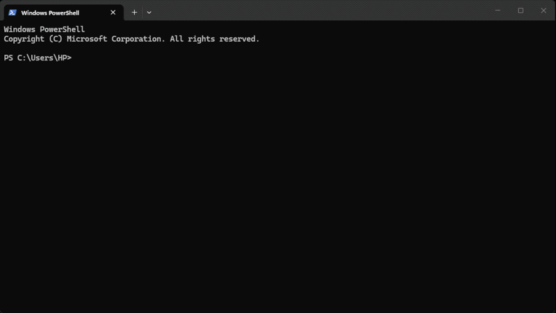

## Groovy Introspective

#### Attach to a running JVM and pick it apart in real time.

Groovy Introspective is a developer tool that attaches to an existing
Java process and opens an interactive Groovy environment inside its runtime,
allowing developers to inspect, debug, and interact with a live JVM.

_Here's a speedy demo:_

---

### Why I Built It

Knowing what's going on inside a large deployed
system as you're developing it can be challenging.
Before I created this tool, I always wished I could _just know_
certain values without having to restart my service or
look through a giant log file.

With this tool, I've been able to quickly test code paths,
grab random JVM values, and inspect any program's state much more clearly.
Every time I exit this tool, I know more than I did before.
It has directly solved a large pain-point for me, so I decided
to open-source it for anyone else to use.

---

### Key Capabilities

- Attaches to running JVM processes
- Interactive Groovy execution
- JVM process discovery
- External agent attachment
- Runtime classpath discovery
- Code completion
- SSH-based interactive sessions
- Live runtime inspection/debugging

---

### How It Works

When the core JAR is invoked from a terminal and a target process is selected, the following process occurs:
1. The JAR extracts its bundled agent JAR to a deterministic cache location,
based on its SHA-256 message digest
2. The JVM invoked from the terminal performs an external-attach onto
the target JVM, supplying it the agent JAR and a port argument.
3. The agent constructs its central classloader, and starts the SSHD session 
on the designated port.
4. The terminal JVM connects to and controls this SSHD session
5. The Groovy REPL and dashboard processes begin

---

### Installing

1. Download the `core-1.0.0.jar` artifact from releases
2. Put it inside your user home directory, in `.grin/bin/`
3. Take one of the startup scripts inside the `scripts` folder on this repo, and put it there too
4. Put that `.grin/bin/` directory on your PATH
5. Try running the `grin` command

Alternatively, you can clone this repository and run the `installGrin`
Gradle task, which will build everything and put `core-1.0.0.jar` in the
right directory for you. All that is required afterward is the script and PATH setup.

---

### What It Uses
Since there's a lot going on, there are a few dependencies.
The REPL itself is built on top of [groovysh](https://groovy-lang.org/groovysh.html)
internals, with multiple differing design choices at play.
Outside of this, grin relocates a lot of external packages, but
the important ones are namely [jline](https://github.com/jline/jline3),
[SSHD](https://mina.apache.org/sshd-project/), and most of Groovy 5.

The reason that it relocates any dependencies at all is for compatibility.
If some running JVM already has `org.jline`, it may have a very different
version. Therefore, I found the best option to be relocating grin's
dependencies explicitly to `me.redot.grin.shaded`
which nobody will ever use (probably).

---

### Why Groovy?

I chose Groovy for the REPL for a few reasons:

1. Its compiler's availability and compatibility.
The core JAR for this tool sits at around 17MB. It contains
all the Groovy dependencies it needs to work its magic.
2. It's fun and easy. Nearly anything that works in Java
will work in Groovy, and Groovy has a lot of healthy abstractions
on top of standard Java syntax. The learning curve is flat.
3. Speed. Due to Groovy's syntax and metaprogramming support,
writing scripts on top of a live JVM is smooth and quick.

---

### Limitations

- Support for multiple SSHD sessions is non-existent;
new SSHD sessions will close the previous one
- Every script is stored in memory for the entire runtime;
there is no supported way to purge them
